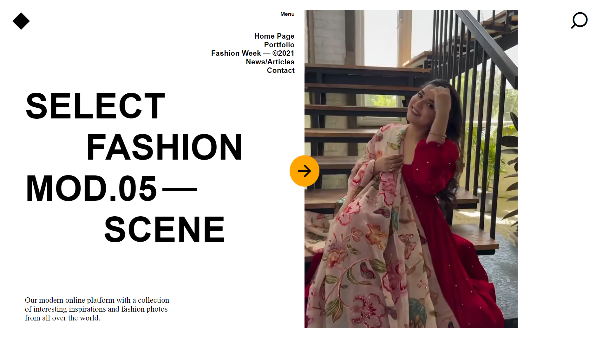

# Fashion Platform Landing Page

## Overview

Welcome to the **Fashion Platform**! This project features a stylish and modern landing page created using HTML and CSS. The landing page serves as an entry point for users to explore the latest fashion trends, products, and collections.

## Demo

Live demo: [Fashion Platform Landing Page](https://piyush-project-1.netlify.app/)  <!-- Replace with your live link -->

### Screenshots

  <!-- Replace with your screenshot path -->

## Features

- **Responsive Design**: Looks great on all devices.
- **Clean Layout**: User-friendly navigation and layout.
- **Modern Aesthetics**: Fashion-forward design and color palette.
- **Fast Loading**: Optimized for performance.

## Technologies Used

- HTML
- CSS

## Getting Started

To view this project locally:

1. Clone the repository:
   ```bash
   git clone https://github.com/yourusername/fashion-platform-landing-page.git

   ```
2. Navigate to the project directory:
   ```bash
   cd Project-1-Fashion-Platform
   ```
3. Open index.html in your web browser.

## Contributing
If you would like to contribute to this project, please follow these steps:

1. Fork the repository.
  
2. Create your feature branch:
   ```bash
   git checkout -b feature/YourFeature
   ```
3. Commit your changes:
   ```bash
   git commit -m 'Add some feature'
   ```
4. Push to the branch:
   ```bash
   git push origin feature/YourFeature
   ```
